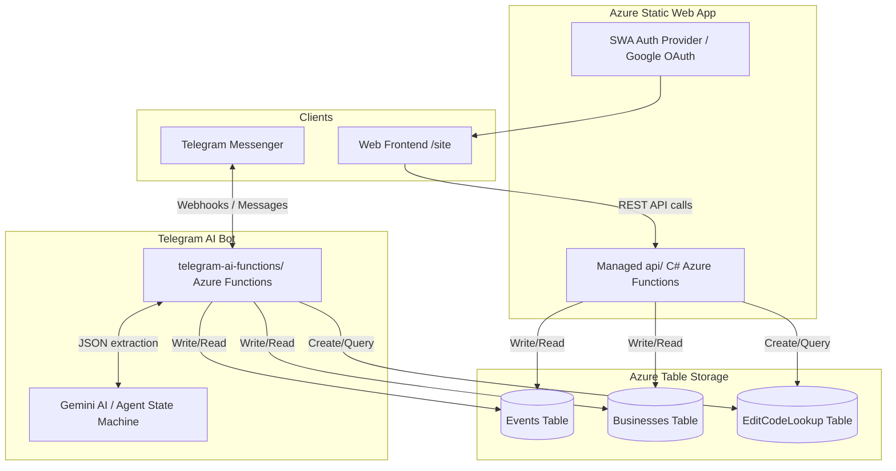

# Burgh Indian Directory & Events Platform

Welcome to the **Burgh Indian** repository. This platform serves as a directory and event registry for the local community. It supports dual-channel data ingestion: an authenticated web interface and an intelligent AI-assisted Telegram bot.

---

## 🏗️ Architecture Overview

The system is built on a modern, decoupled architecture designed for high scalability, easy maintenance, and zero-downtime serverless deployments.

---

## 📂 Repository Layout

*   [site/](site/): Contains the static website frontend pages (HTML, CSS, Vanilla JavaScript).
*   [api/](api/): Contains the Azure Static Web Apps managed C# backend API (Functions for submitting, updating, and looking up entries).
*   [telegram-ai-functions/](telegram-ai-functions/): An independent C# Azure Functions project powering the Telegram bot, which features advanced AI-driven extraction using Google Gemini.
*   [docs/](docs/): Detailed design docs and operational runbooks:
    *   [agent_flow.md](docs/agent_flow.md): Explains the Telegram bot's AI flow.
    *   [static-submit-azure-functions-table-storage.md](docs/static-submit-azure-functions-table-storage.md): Details the web submissions database design.
    *   [static-web-apps-google-auth.md](docs/static-web-apps-google-auth.md): Describes SWA Google/Gmail Authentication setup.

---

## 📥 Data Ingestion Channels

### 1. Static Web App Submissions (`site/` & `api/`)
Users can submit entries directly via the website. To protect against spam and ensure data ownership:
*   **Authentication**: Built-in Azure Static Web Apps Google Provider auth. When users log in, their Gmail address is resolved server-side using the `x-ms-client-principal` header (decoded via [AuthHelpers](api/Services/AuthHelpers.cs)).
*   **Submission Details**: Once logged in, users can submit **Events** or **Businesses** with specific metadata and fixed tags.
*   **Edit Code**: A server-generated `EditCode` is returned, allowing subsequent modifications to the post without requiring a full user profile system.

### 2. Telegram Bot (`telegram-ai-functions/`)
The Telegram bot acts as an **Intent-Based State Machine** powered by Gemini.
*   Users send free-form text or photos of flyers/business cards.
*   The bot routes the payload to Gemini, which returns a unified JSON payload matching the `AgentResponse` structure defined in [agent_flow.md](docs/agent_flow.md#the-unified-gemini-payload).
*   **State Machine Intents**:
    *   `ASK_TYPE`: Prompts user to specify if the submission is an Event or Business via custom keyboard buttons.
    *   `VALIDATE_EVENT` / `VALIDATE_BUSINESS`: Formally validates extracted properties. If incomplete, Gemini flags missing fields and outputs a structured template for the user to copy, fill, and reply.
    *   `GENERATE_IMAGE`: Handles image generation or placeholder workflows.
    *   `INSTRUCTIONS`: Friendly welcome and instruction system.

---

## 💾 Persistance & Database Schema

The platform persists data in **Azure Table Storage** using a high-performance partitioning strategy.

### Partitioning Design
To avoid scanning the entire database and allow easy monthly archiving or deletions:
*   **Month Buckets**: The `PartitionKey` for the main `Events` and `Businesses` tables is structured as `yyyy-MM` (e.g. `2026-04`) derived from the creation date (`CreatedAtUtc`).
*   **Chronological Row Keys**: The `RowKey` is structured as `yyyyMMddHHmmssfff-<short random suffix>` to ensure uniqueness and proper chronological sorting inside the partition.
*   **Private Lookup Table**: Since users search/edit posts using an `EditCode` without knowing the creation month, a dedicated `EditCodeLookup` table maps `EditCode` (as `RowKey` under partition `edit`) to the target entity's `PartitionKey` and `RowKey`.

### Data Tables

#### 1. Events Table
Stores community events.
*   **PartitionKey**: `yyyy-MM`
*   **RowKey**: `yyyyMMddHHmmssfff-XXXXX`
*   **Tags**: Comma-separated normalized list of allowed event tags: `Community`, `Culture`, `Family`, `Food`, `Temple`, `Professional`, `Kids`, `Other`.

#### 2. Businesses Table
Stores local business listings.
*   **PartitionKey**: `yyyy-MM`
*   **RowKey**: `yyyyMMddHHmmssfff-XXXXX`
*   **Tags**: Comma-separated normalized list of allowed business tags: `Restaurant`, `Grocery`, `Temple`, `Service`, `Shopping`, `Education`, `Health`, `Other`.

#### 3. EditCodeLookup Table
Maps generated edit codes to target rows.
*   **PartitionKey**: `edit`
*   **RowKey**: `EditCode` (e.g. `A7K2P`)
*   **Properties**: `EntityType`, `TargetTable`, `TargetPartitionKey`, `TargetRowKey`, `SubmitterEmail`.

---

## 🔌 API Endpoints & Models

All website API endpoints are hosted under the managed `api/` project.

### Endpoint Overview

| Method | Endpoint | Description | Auth Required |
| :--- | :--- | :--- | :--- |
| **GET** | `/api/auth/session` | Gets authenticated session info & Gmail address | No (Returns status) |
| **GET** | `/api/events` | Retrieves approved events | No |
| **POST** | `/api/events` | Creates a new event submission | Yes |
| **PUT** | `/api/events/{partitionKey}/{rowKey}` | Updates an existing event submission | Yes (Must match EditCode) |
| **GET** | `/api/businesses` | Retrieves approved businesses | No |
| **POST** | `/api/businesses` | Creates a new business submission | Yes |
| **PUT** | `/api/businesses/{partitionKey}/{rowKey}` | Updates an existing business listing | Yes (Must match EditCode) |
| **POST** | `/api/posts/lookup` | Resolves an `EditCode` and returns the entry | Yes |

